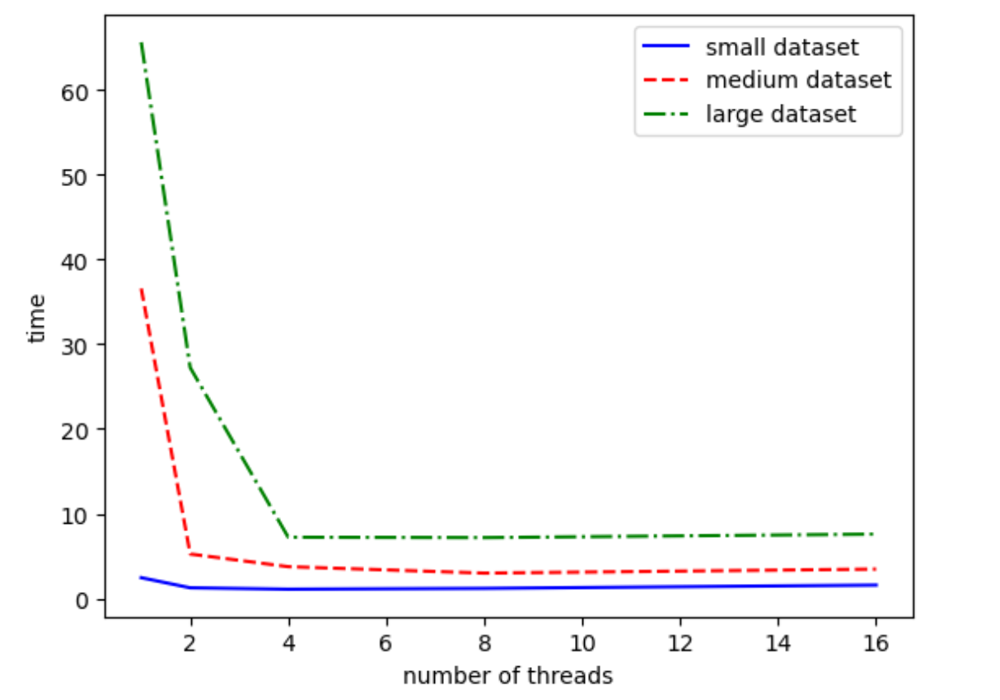

# CSCI596 Final Project: Parallel Computing based PageRank Optimization
This is a readme file for the Parallel Computing based PageRank Optimization project. 
This project implements an optimized version of the PageRank algorithm, leveraging parallel processing techniques to enhance efficiency in large-scale graph computations.

### Introduction to PageRank
Originally developed by Google, the PageRank algorithm is a graph-based ranking method that assigns relative importance to nodes (e.g., web pages) based on their link structure. Each node's rank is determined by the ranks of nodes linking to it, with the goal of identifying influential nodes in a network. By iteratively distributing rank scores across links, PageRank helps surface high-authority pages in web search, making it foundational in information retrieval and network analysis.

### About This Project
This project uses PySpark to parallelize the iterative PageRank computation, optimizing for both runtime and scalability. Key features include:
* Parallelized Iterative Computation: Efficiently handles multiple iterations across distributed nodes.
* Optimized Data Collection: Minimizes data shuffling to reduce overhead.
* Flexible Configuration: Allows easy tuning for various graph sizes and cluster configurations.

  This implementation is ideal for high-volume datasets in applications such as web search, social network analysis, and recommendation systems.  

## 0. Prerequisites
Only needed is Colab Free Version.
## 1. How to compile and run
Type:
* `pip install pyspark`
* `py PageRank_with_parallelization.py`
## 2. Files
The following files are included in this folder, in addition to this readme
file, readme.md.
<ul>
<li>PageRank_with_parallelizatio.py: Main Python program</li>
<li>generateDataset.py: Code block to truncate the original dataset into different sizes</li>
<li>experiment_graph.ipynb: Code block to draw the result plot</li>
<li>web-Google.txt: The original dataset</li>
<li>smallDataset.txt: The dataset with nodes id <= 100k</li>
<li>mediumDataset.txt: The dataset with nodes id <= 600k</li>
<li>TestResult: Folder of all the experiment results: .txt files as outputs and .png file as result visualization</li>
</ul>

## 3. Dataset

For this project, we use datasets derived from `web-Google.txt`, originally obtained from [Kaggle](https://www.kaggle.com/code/wakkkka/homework-pagerank/input). These datasets are designed to study the effects of different dataset sizes on parallel computing performance. We have prepared three datasets with varying sizes:

* `smallDataset.txt`: 697 KB
* `mediumDataset.txt`: 34.3 MB
* `web-Google.txt`: 71.9 MB (original dataset)

Each of these datasets will be used to evaluate the efficiency of our parallel computing solution.

## 4. Experiment
In this experiment, we will evaluate our program using three generated datasets, analyzing its performance under varying levels of parallelism. Specifically, we will test with 1, 2, 4, 8, and 16 parallel threads. We will record the execution time for each level of parallelism and plot the results to observe performance trends. 

As expected, calculating the rank for larger graphs takes more time. Initially, we observe performance improvements as we increase parallelism; however, beyond 4 threads, the performance gains become minimal. This limited improvement beyond a certain level of parallelism may be due to two factors:
1. The dataset used in our experiment is relatively small, which may lead to diminishing returns as parallelism increases. With multiple cores in use, each core's processing capacity may exceed the dataset's demands, causing performance to plateau. Additionally, increased cross-process communication at higher levels of parallelism can further consume resources, resulting in minimal or even slightly increased computation times.
2. In industrial applications, Spark is typically deployed across multiple machines within a distributed framework, allowing it to efficiently handle large-scale data processing in parallel. However, due to resource limitations, our model currently runs on a single local machine, preventing Spark from leveraging its full potential in distributed parallel processing. With multi-machine deployment, we expect that the performance improvements would be more significant.

